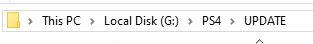
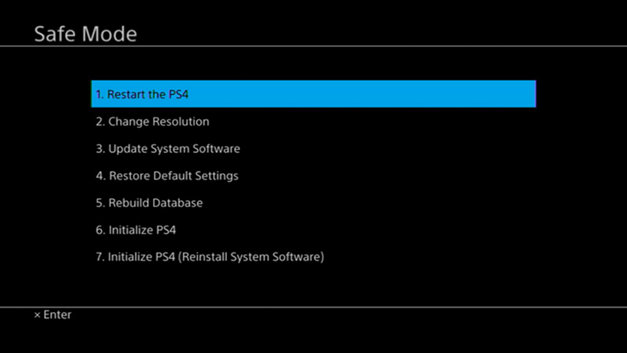
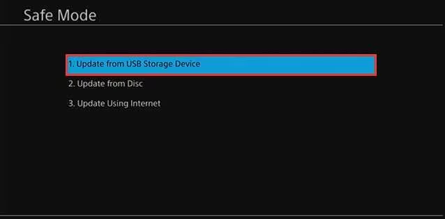

# PS4-Firware-Update-or-Reinstall-Guide          
How to update or reinstall ps4 firmware manually.     
     
System *Software* and *Firmware* are interchangable within the context of the PS4     
           
# What are firmware update and reinstall files              
1. On the darthsternie website *Official Firmwares* are update files that let you update from for example firmware 9.50 to 9.60       
2. On the darthsternie website *Recovery Firmwares* are firmware reinstalation/recovery files that wipe the console of all user data this option is used when replacing the HDD and in either case  you can stay on the same firmware you are currently on.
# Downloading firmware and Updating                     
1. Go to [Darthsternie](https://darthsternie.net/ps4-firmwares)             
2. Download the firmware update version to which you want to update to          
3. Grab a USB flash drive and format it to EXFAT              
4. Create the following folder path on the USB PS4/UPDATE    
      
5. Then paste the downloaded file inside the UPDATE folder            
6. Plug the USB into your PS4      
7. Turn your PS4 off and then hold down the power button untill you hear a second boot tune      
8. Connect your PS4 controller to the console with a DATA TRANSFER capable micro usb cable and press the PS button       
9. Once in Safe mode choose option 3. Update System Software       
         
10. In the following menu choose option 1. Update from USB Storage Device             
        
11. Press *YES* and *NEXT* or *ACCEPT* to any addidional options       
             
# Downloading firmware and Reinstalling                   
1. Go to [Darthsternie](https://darthsternie.net/ps4-firmwares)             
2. Download the firmware recovery version for your PS4             
3. Grab a USB flash drive and format it to EXFAT              
4. Create the following folder path on the USB PS4/UPDATE    
      
5. Then paste the downloaded file inside the UPDATE folder            
6. Plug the USB into your PS4      
7. Turn your PS4 off and then hold down the power button untill you hear a second boot tune      
8. Connect your PS4 controller to the console with a DATA TRANSFER capable micro usb cable and press the PS button       
9. Once in Safe mode choose option 7. Initialize PS4 (Reinstall System Software)          
         
10. It will then ask you to connect(or already have connected) a USB stick with the minimum firware version possible (usually curent one you were on)          
11. Press *OK* to continue and *ACCEPT* or *OK* to any addidional options             
       
# You can then follow one of these other guides to jailbreak your console and etc     
# 1. [Guides Thread](https://github.com/DrYenyen/Guide-Links-For-PS4)        
# 2. [How to use a GUI tool to run PPPwn on Windows](https://github.com/DrYenyen/PPPwnGo-Guide)       
# 3. [How to set up Raspberry-Pi on Windows for PPPwn](https://github.com/DrYenyen/PPPwn-Setup-Guide-For-Raspberry-Pi)                                         
# 4. [How to install FPKGS](https://github.com/DrYenyen/How-To-Install-PS4-FPKGS)                            
# 5. [How to set up PPPwn on a OpenWRT compatible router(by FalsePhilosopher)](https://github.com/FalsePhilosopher/PPPwnWRT)                         	 
# 6. [How-To-Use-Cheats-and-Patches-On-PS4](https://github.com/DrYenyen/How-To-Use-Goldhen-Cheats-and-Patches-On-PS4)         
